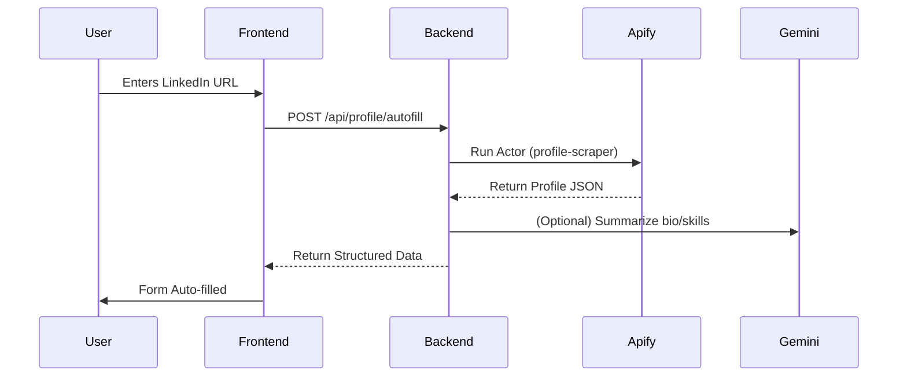

# Implementation Plan - LinkedIn Profile Autofill Fix

## Goal
Fix the "Profile Autofill" feature which currently fails because it attempts to make the LLM "read" a valid LinkedIn URL directly. The solution is to implement a real backend scraping service (using a provider like Apify or RapidAPI) and pass the structured data to the frontend.

## 🔴 Current Issues
1. **Hallucination/Failure**: `UserProfileSetup.tsx` sends the URL to Gemini, which cannot access the internet to scrape LinkedIn.
2. **Missing Backend Logic**: There is no dedicated endpoint handling this; logic is leaked into the frontend.
3. **No BrightData**: "BrightData" was mentioned but does not exist in the codebase.

## 🏗 Proposed Architecture

### 1. Backend (FastAPI)
- **New Endpoint**: `POST /api/profile/autofill`
- **Input**: `{ "linkedin_url": "..." }`
- **Logic**:
    1. Receive URL.
    2. Call **Scraping Service** (Apify `linkedin-profile-scraper` or similar) to get JSON.
    3. (Optional) Parse/Format with Gemini to match frontend schema.
    4. Return JSON `{ bio, experience, skills, ... }`.

### 2. Frontend (React)
- **Refactor `enhanceProfile`**:
    - Remove direct Gemini call for extraction.
    - Call `fetch('/api/profile/autofill')`.
    - Populate state with returned JSON.

## 🛠 Implementation Steps

### Phase 1: Backend Setup (Backend Specialist)
- [ ] Create/Update `dashboard/backend/main.py` (or new router).
- [ ] Implement scraping logic (recommend **Apify** since we already have the client).
- [ ] Add `API_KEY` handling for Apify.

### Phase 2: Frontend Integration (Frontend Specialist)
- [ ] Modify `UserProfileSetup.tsx` to handle the API response.
- [ ] Add loading states and error handling for the new endpoint.

### Phase 3: Verification (Test Engineer)
- [ ] Test with a real LinkedIn URL.
- [ ] Verify data mapping (Skills, Experience, etc.).

## 📋 Logic Flow

